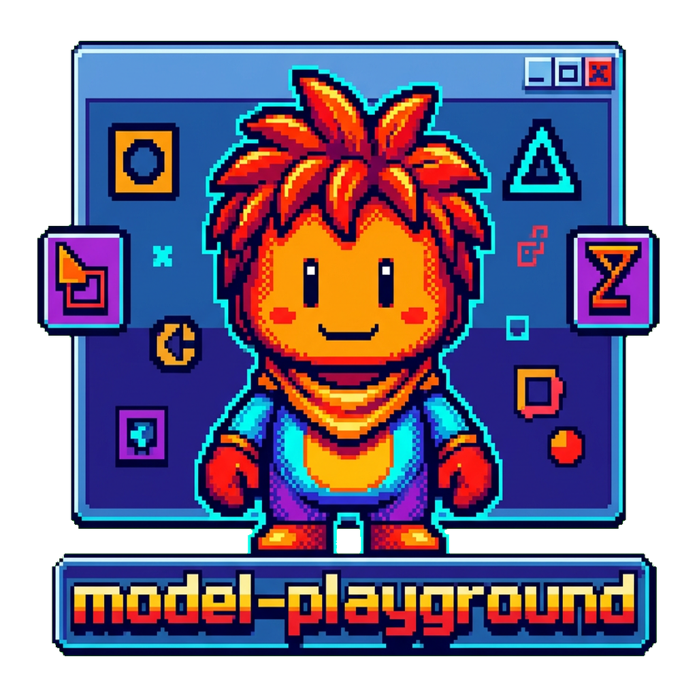

<div align="center">
  

  **🧠 Run LLMs directly in your browser — no server, no API keys, just WebGPU ⚡**

  [Live Demo](https://model-playground.vercel.app)
</div>

## Overview

**The Pain:** Testing small language models means setting up Python environments, downloading weights, and wrestling with CUDA drivers — all before generating a single token.

**The Solution:** model-playground runs ONNX-optimized LLMs entirely in the browser using WebGPU acceleration (with WASM fallback), powered by [Hugging Face Transformers.js](https://huggingface.co/docs/transformers.js).

**The Result:** Open a URL, pick a model, and start chatting — zero setup, zero dependencies, zero server costs.

<div align="center">

| Metric | Value |
|--------|-------|
| 🖥️ Backend | None — 100% client-side |
| ⚡ Acceleration | WebGPU (fp16) / WASM (q4) |
| 📦 Smallest model | ~250MB download |
| 🔧 Setup | `npm install && npm run dev` |

</div>

## ✨ Features

- 🚀 **In-browser inference** — models run entirely on your device via Web Workers
- ⚡ **WebGPU acceleration** — fp16 precision with automatic WASM fallback for unsupported browsers
- 💬 **Chat interface** — real-time token streaming with tokens/second counter
- 🔄 **Multiple models** — switch between Qwen3 0.6B, Qwen3 1.7B, and SmolLM2 360M
- 🎛️ **Tunable generation** — temperature, top-p, top-k, repetition penalty, max tokens
- 📊 **Progress tracking** — live download progress overlay when loading models
- 🔒 **Private by design** — nothing leaves your browser, ever

## 🚀 Quick Start

```bash
git clone https://github.com/tsilva/model-playground.git
cd model-playground
npm install
npm run dev
```

Open [http://localhost:3000](http://localhost:3000) — the default model (Qwen3 0.6B) loads automatically.

## 🏗️ Architecture

```
src/
├── app/              # Next.js app router (layout + page)
├── components/       # UI — ChatInterface, ModelSelector, SettingsPanel, StatusBar
├── hooks/            # useWebGPU (feature detection), useInferenceWorker (worker bridge)
├── lib/              # Constants — model presets, default generation params
├── types/            # TypeScript interfaces — messages, worker protocol
└── workers/          # Web Worker — model loading, tokenization, generation
```

All inference runs in a dedicated Web Worker (`inference.worker.ts`) using `@huggingface/transformers`, keeping the UI thread free.

## 🎛️ Supported Models

| Model | Size | Download |
|-------|------|----------|
| Qwen3 0.6B | 0.6B params | ~400MB |
| Qwen3 1.7B | 1.7B params | ~1GB |
| SmolLM2 360M | 360M params | ~250MB |

Models are loaded from the [ONNX Community](https://huggingface.co/onnx-community) on Hugging Face and cached in the browser after first download.

## 🌐 Deployment

The app is configured as a static export (`output: "export"`) with required `Cross-Origin-Embedder-Policy` and `Cross-Origin-Opener-Policy` headers for `SharedArrayBuffer` support.

Deploy to Vercel:

```bash
npm run build
```

The included `vercel.json` handles the required COOP/COEP headers automatically.

## 🛠️ Tech Stack

- [Next.js 16](https://nextjs.org/) — static export
- [React 19](https://react.dev/) — UI
- [@huggingface/transformers](https://huggingface.co/docs/transformers.js) — in-browser inference
- [Tailwind CSS 4](https://tailwindcss.com/) — styling
- [TypeScript](https://www.typescriptlang.org/) — type safety
- [WebGPU](https://www.w3.org/TR/webgpu/) / [WebAssembly](https://webassembly.org/) — compute backends

## 📄 License

MIT
